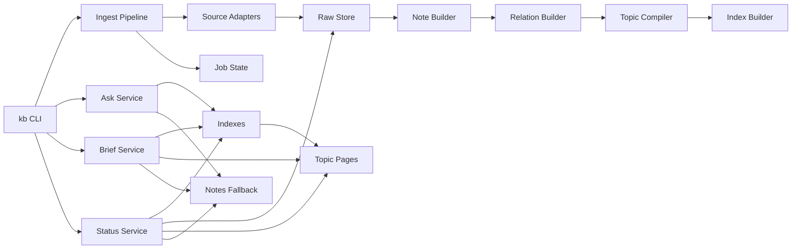
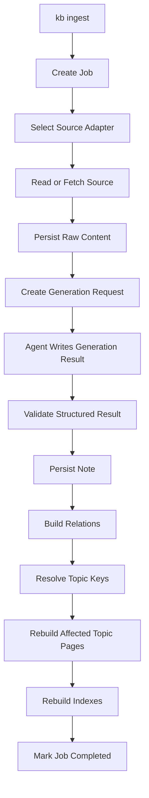
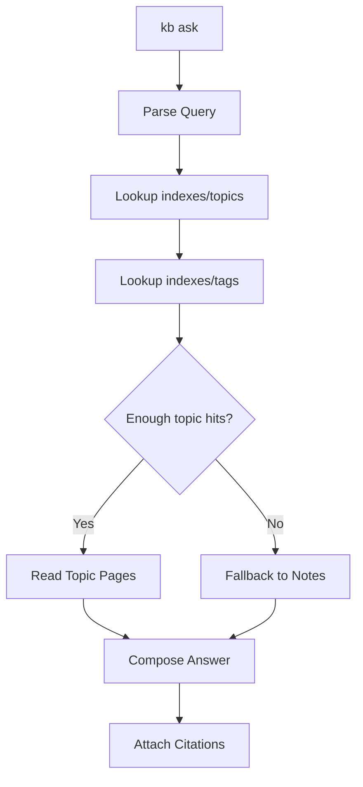
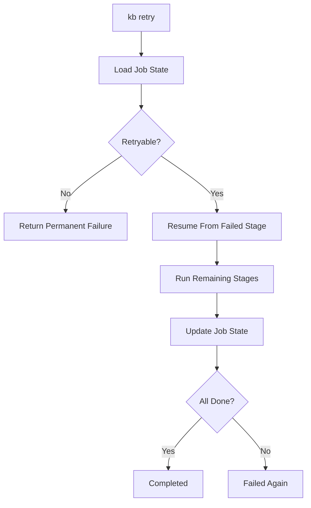

# AI 知识库技术架构文档

## 1. 文档目标

本文档定义 AI 知识库 MVP 的技术架构，用于指导后续项目实现。目标是让系统在本地环境下稳定完成：

- 链接和本地文件入库
- 原子笔记生成
- 主题页编译
- 索引更新
- 问答、选题、周报输出

本项目不是通用知识管理平台，而是一个本地单人使用的知识编译系统。

## 2. 技术约束

- 运行方式：本地 CLI
- 存储方式：纯文件存储
- 执行方式：全同步 `ingest`
- 处理模式：单进程、串行执行
- 语义生成：首版由智能体完成，不接 LLM API
- Prompt 管理：文件化 Prompt
- 生成结果：结构化 schema + Pydantic 校验
- 状态管理：分阶段落盘 + 状态标记 + 可重试

## 3. 总体架构

系统以 `kb` 为统一入口，围绕一条稳定的知识编译主链运行：

`content -> note -> relation -> topic -> index -> ask/brief`

### 3.1 总体架构图



### 3.2 分层说明

- `CLI 层`：接收命令和参数，不承载业务细节
- `Pipeline 层`：只负责编排写入链路
- `Adapter 层`：统一不同来源输入
- `Builder/Compiler 层`：生成笔记、关联、主题页、索引
- `Storage 层`：负责文件读写
- `Service 层`：提供问答、选题、周报等只读消费能力
- `State 层`：记录任务执行过程和失败状态

## 4. 目录结构

```text
knowledge/
  raw/
  notes/
  wiki/
  indexes/
  briefs/
  prompts/
  state/
  logs/
  scripts/
  docs/
```

运行目录均相对于知识库工作区 `knowledge/`。功能代码位于 `knowledge/kb/`，外层仓库只保留工程配置、测试和开发文档。

### 4.1 目录职责

- `raw/`：原始资料和原始元数据
- `notes/`：原子笔记
- `wiki/`：主题页
- `indexes/`：索引导航文件
- `briefs/`：选题和周报结果
- `prompts/`：Prompt 模板和标签体系
- `state/`：任务状态和重试记录
- `logs/`：运行日志

## 5. 核心模块

### 5.1 Ingest Pipeline

负责写入链路 orchestration，是唯一总写入口。

### 5.2 Source Adapters

负责把不同来源转成统一 `Content` 对象。

首版范围：

- URL：`generic_web`
- 文件：`txt`、`md`、`pdf`
- 文本：直接文本

GitHub 专用 adapter 放到 Phase 1.5 或 Phase 2。微信公众号首版降级为复制正文或文本导入。

### 5.3 Note Builder

基于原始内容和智能体生成结果生成原子笔记，输出结构化数据并落盘到 `notes/`。

首版不直接调用 LLM API。Note Builder 的职责是：

1. 生成 `GenerationRequest`
2. 等待智能体产出 `GenerationResult`
3. 校验结果是否符合 schema
4. 校验通过后写入 `notes/`

摘要、标签、立场判断等语义内容由智能体完成，Note Builder 不自行生成语义结论。

### 5.4 Relation Builder

基于标签重叠和标题关键词打分，建立轻量关联，并给出 `topic_keys`。

### 5.5 Topic Compiler

只生成主题页，不做实体页。仅重建受影响的主题页，不全量重建。

### 5.6 Index Builder

负责生成导航索引，不承载知识结论。

### 5.7 Ask Service

只读消费 `indexes/`、`wiki/`、`notes/`，不允许写操作。

### 5.8 Status Service

只读消费 `indexes/` 和内容目录，返回知识库数量、最近笔记、标签和来源，用于回答盘点类问题。

### 5.9 Brief Service

生成：

- `brief topics`
- `brief weekly`

## 6. 核心数据对象

### 6.1 Content

统一输入内容对象。

核心字段：

- `content_id`
- `source_type`
- `source_uri`
- `raw_text`
- `meta`

### 6.2 Note

原子笔记对象。

核心字段：

- `note_id`
- `content_id`
- `title`
- `tags`
- `summary`
- `stance`
- `key_points`
- `my_judgement`
- `useful_for`
- `related_note_ids`
- `topic_keys`

Phase 1 的 `stance` 只允许：

- `approve`
- `doubt`
- `neutral`
- `todo`

### 6.3 Topic

主题页对象。

核心字段：

- `topic_key`
- `title`
- `source_note_ids`
- `updated_at`

### 6.4 Job

任务状态对象。

核心字段：

- `job_id`
- `content_id`
- `current_stage`
- `completed_stages`
- `retry_count`
- `status`

### 6.5 GenerationRequest

智能体生成请求对象。

核心字段：

- `request_id`
- `job_id`
- `content_id`
- `generation_type`
- `source_paths`
- `prompt_path`
- `output_schema`
- `result_path`

文件格式：

- Markdown + YAML frontmatter
- frontmatter 存机器字段
- 正文写任务说明、读取范围、禁止事项、输出 schema

整体系统支持的 `generation_type` 包括：

- `note`
- `topic`
- `brief_topics`
- `brief_weekly`

当前已支持的 `generation_type` 包括 `note / topic / brief_topics / brief_weekly`。

其中 `note` 由 `kb ingest --continue <job_id>` 落盘，`topic` 由 `kb compile --continue <job_id> --topic-key <topic_key>` 落盘，`brief_topics / brief_weekly` 分别由 `kb brief topics --continue <job_id>`、`kb brief weekly --continue <job_id>` 落盘。

GenerationRequest 示例：

```md
---
request_id: gen_20260618143022_a8f31c92_note
job_id: job_20260618143022_a8f31c92
content_id: cnt_20260618_a8f31c92
generation_type: note
source_paths:
  - raw/20260618/cnt_20260618_a8f31c92.md
prompt_path: prompts/note.md
output_schema: note_v1
result_path: state/generation_results/job_20260618143022_a8f31c92-note.yaml
---

## 任务

请读取 `source_paths` 中的原文，生成一份结构化 note 结果。

## 读取范围

- 必须读取 `source_paths`
- 可以读取 `prompt_path`
- 不要读取无关目录

## 输出要求

- 只写入 `result_path`
- 不要直接修改 `notes/`、`indexes/`、`wiki/`
- 输出必须符合 `note_v1` schema

## payload schema

见本文档 Phase 1 `generation_type: note` 的 `payload` schema。
```

### 6.6 GenerationResult

智能体生成结果对象。

核心字段：

- `request_id`
- `job_id`
- `generation_type`
- `status`
- `payload`
- `sources`
- `created_at`

`payload` 必须通过对应 Pydantic schema 校验后才能落盘。

Phase 1 `generation_type: note` 的 `payload` schema：

```yaml
payload:
  title: string
  summary: string
  tags: string[]          # 3-5 个
  stance: approve|doubt|neutral|todo
  key_points: string[]    # 3-7 条
  my_judgement: string
  useful_for: string[]
  related_topics: string[]
```

映射规则：

- `payload.title` -> note frontmatter `title`
- `payload.summary` -> note frontmatter `summary`
- `payload.tags` -> note frontmatter `tags`
- `payload.stance` -> note frontmatter `stance`
- `payload.related_topics` -> Phase 1 只作为正文“主题候选”，不创建 topic
- `topic_keys` Phase 1 默认空数组，Phase 2 由 topic compiler 写入

### 6.7 ID 与文件命名规则

ID 采用“日期 + 短 hash”，不使用自增序号。

规则：

- `content_id`：`cnt_<YYYYMMDD>_<source_key_hash>`
- `note_id`：`note_<YYYYMMDD>_<source_key_hash>`
- `job_id`：`job_<YYYYMMDDHHMMSS>_<source_key_hash>`
- `request_id`：`gen_<YYYYMMDDHHMMSS>_<source_key_hash>_<generation_type>`

`source_key_hash` 取前 8 位，来源如下：

- URL：标准化后的 `source_uri`
- 本地文件：绝对文件路径 + 文件内容 hash
- 纯文本：文本内容 hash

文件命名：

- `raw/YYYYMMDD/<content_id>.md`
- `raw/YYYYMMDD/<content_id>.meta.yaml`
- `notes/YYYYMMDD/<note_id>.md`
- `state/jobs/<job_id>.json`
- `state/generation_requests/<job_id>-<generation_type>.md`
- `state/generation_results/<job_id>-<generation_type>.yaml`

## 7. 写入链路设计

### 7.1 Ingest 流程图



### 7.2 阶段说明

1. `received`
2. `raw_saved`
3. `generation_requested`
4. `generation_completed`
5. `note_generated`
6. `relation_built`
7. `topics_updated`
8. `indexes_updated`
9. `completed`

失败时进入：

- `failed`
- `permanent_failed`

## 8. 问答链路设计

### 8.1 Ask 流程图



### 8.2 查询策略

Phase 1 查询策略：

- 直接扫描 `notes/**/*.md`
- 读取每条 note 的 frontmatter 和正文摘要
- 对 `title / tags / summary / source_uri / 正文摘要` 做关键词匹配
- 选出 Top 3-5 条原子笔记作为回答上下文
- 最终答案必须附 note 文件路径和原始 source

Phase 2 查询策略：

- 先查 `topics.md`
- 再查 `tags.md`
- 按需补查 `recent.md` 和 `sources.md`
- 优先读取命中的 1-3 个主题页
- 不足时补读 2-5 条原子笔记
- 最终答案必须附来源

## 9. 主题页编译策略

### 9.1 主题创建规则

- 至少 2 条相关笔记才允许创建主题页
- 1 条笔记只保留候选 `topic_keys`
- `topic_key` 必须稳定，不允许自由漂移

### 9.2 主题更新规则

仅在以下情况重建：

1. 新笔记命中已有主题
2. 新笔记与已有笔记首次满足建主题条件

### 9.3 主题页结构

主题页正文固定五段：

1. 当前主题定义
2. 已形成的主要结论
3. 关键分歧/未决问题
4. 可延伸方向
5. 来源笔记列表

## 10. 索引设计

Phase 1 索引文件：

- `indexes/tags.md`
- `indexes/recent.md`
- `indexes/sources.md`

Phase 1 暂不生成：

- `indexes/topics.md`
- `indexes/*.json`
- 向量索引
- 数据库索引

Phase 2 引入：

- `indexes/topics.md`

原则：

- 索引只做定位
- Phase 1 索引主要服务人工和智能体快速阅读，`ask` 仍以扫描 `notes/` 为准
- Phase 2 主题页承载结论
- 原子笔记负责细节兜底

## 11. 错误处理与重试

### 11.1 错误处理原则

- 先保产物，再记状态
- 重试只补失败阶段
- 已成功阶段不重复执行

### 11.2 重试流程图



### 11.3 重试入口

- `kb retry job <job_id>`
- `kb retry content <content_id>`

## 12. 配置与 Prompt

### 12.1 配置文件

使用项目级 `kb.yaml`，负责：

- 路径配置
- 标签表路径
- 主题规则
- 适配器开关
- 日志级别

首版不配置模型 provider，也不要求 API key。后续如果接入 Claude/OpenAI/本地模型，再增加 provider 配置，密钥仍走环境变量。

### 12.2 Prompt 文件

存放在 `prompts/`：

- `note.md`
- `topic.md`
- `brief-topics.md`
- `brief-weekly.md`
- `tags.md`

## 13. 智能体生成层

首版不实现 LLM API 调用层，不接 Claude/OpenAI/本地模型 API。

采用“生成请求 + 智能体生成 + 结构校验”的方式：

1. `kb` 读取输入并保存原文
2. `kb` 生成 `GenerationRequest`
3. 智能体读取请求、原文和 Prompt
4. 智能体写入 `GenerationResult`
5. `kb` 使用 Pydantic 校验结果
6. 校验通过后写入 `notes/`、`wiki/`、`briefs/`

职责边界：

- `kb`：抓取、文件读写、状态管理、生成请求、schema 校验、索引更新
- 智能体：摘要、标签选择、立场判断、主题页编译、选题和周报文本生成

所有智能体生成结果必须是结构化 schema，不允许自由文本直接落盘。

### 13.1 交接文件

建议首版增加：

- `state/generation_requests/`
- `state/generation_results/`

请求文件命名：

- `state/generation_requests/<job_id>-<generation_type>.md`

请求文件采用 Markdown + YAML frontmatter。frontmatter 存 `request_id / job_id / content_id / generation_type / source_paths / prompt_path / output_schema / result_path`，正文写任务说明、读取范围、禁止事项和输出 schema。

结果文件命名：

- `state/generation_results/<job_id>-<generation_type>.yaml`

`GenerationResult` YAML 最少字段：

```yaml
request_id: gen_20260618143022_a8f31c92_note
job_id: job_20260618143022_a8f31c92
content_id: cnt_20260618_a8f31c92
generation_type: note
status: completed
created_at: 2026-06-18T14:32:00+08:00
sources:
  - path: raw/20260618/cnt_20260618_a8f31c92.md
    source_uri: https://example.com/article
payload:
  title: 示例标题
  summary: 一句话摘要
  tags: [ai, writing]
  stance: approve
  key_points:
    - 关键点一
  my_judgement: 我的判断
  useful_for:
    - 写作选题
  related_topics: []
```

### 13.2 CLI 交接方式

`kb ingest <input>` 首次执行时完成：

1. 创建 job
2. 保存 raw
3. 创建 generation request
4. 返回 `needs_generation` 状态和请求文件路径

智能体生成结果后，再执行：

```bash
kb ingest --continue <job_id>
```

继续完成：

1. 读取 generation result
2. 校验 schema
3. 写入 note
4. Phase 1 更新 indexes
5. Phase 2 之后更新 relation/topic/index
6. 标记 job completed

这仍属于 `kb ingest` 写入链路，不新增第二套业务入口。

### 13.3 CLI 返回协议

所有 `kb` 命令默认向 stdout 输出 JSON。智能体负责把 JSON 转成自然语言回复。

通用字段：

- `ok`：布尔值
- `command`：实际执行的命令
- `status`：状态枚举
- `message`：面向智能体的简短说明

`status` 枚举：

- `needs_generation`
- `completed`
- `failed`
- `permanent_failed`
- `duplicate`

`next_action` 枚举：

- `write_generation_result`
- `run_continue`
- `retry`
- `none`

`kb ingest <input>` 返回示例：

```json
{
  "ok": true,
  "command": "kb ingest",
  "status": "needs_generation",
  "job_id": "job_20260618143022_a8f31c92",
  "content_id": "cnt_20260618_a8f31c92",
  "next_action": "write_generation_result",
  "generation_request_path": "state/generation_requests/job_20260618143022_a8f31c92-note.md",
  "generation_result_path": "state/generation_results/job_20260618143022_a8f31c92-note.yaml",
  "message": "Generation request created. Read request file and write result file."
}
```

`kb ingest --continue <job_id>` 成功返回示例：

```json
{
  "ok": true,
  "command": "kb ingest --continue",
  "status": "completed",
  "job_id": "job_20260618143022_a8f31c92",
  "note_path": "notes/20260618/note_20260618_a8f31c92.md",
  "index_paths": [
    "indexes/recent.md",
    "indexes/tags.md",
    "indexes/sources.md"
  ],
  "next_action": "none",
  "message": "Note persisted and indexes updated."
}
```

失败返回示例：

```json
{
  "ok": false,
  "command": "kb ingest --continue",
  "status": "failed",
  "job_id": "job_20260618143022_a8f31c92",
  "error_code": "GENERATION_RESULT_NOT_FOUND",
  "error_message": "Generation result file does not exist.",
  "retryable": true,
  "next_action": "write_generation_result"
}
```

### 13.4 阶段边界

Phase 1 只要求跑通：

`ingest -> raw -> generation_request -> note -> indexes -> ask`

Phase 2/3 已采用同一套两段式生成协议扩展：

- `ingest --continue` 写入 note 后构建轻量关联，并在满足条件时生成 `topic` 请求。
- `compile --continue` 校验 `topic` 结果并写入 `wiki/topic-<topic_key>.md`，同时更新 `indexes/topics.md`。
- `brief topics` 与 `brief weekly` 先生成请求，智能体写入结构化结果后再由 `--continue` 写入 `briefs/`。

## 14. 去重与幂等

### 14.1 去重策略

双层去重：

1. `source_uri / 文件路径`
2. `content_hash`

重复入库命中时直接返回 `duplicate`，不重新生成 note。

返回示例：

```json
{
  "ok": true,
  "command": "kb ingest",
  "status": "duplicate",
  "existing_content_id": "cnt_20260618_a8f31c92",
  "existing_note_path": "notes/20260618/note_20260618_a8f31c92.md",
  "next_action": "none",
  "message": "Source already exists."
}
```

### 14.2 幂等要求

- 同一 `content_id` 不生成重复内容
- `raw/` 不重复写
- `notes/` 内容不变则不重建
- `wiki/` 按 `topic_key` 覆盖更新
- `indexes/` 重建当前视图，不追加脏数据

所有文件写入采用临时文件 + 原子替换：

```text
<target>.tmp -> rename -> <target>
```

中途失败时不得留下半截 Markdown/YAML 作为有效产物。

### 14.3 并发锁

Phase 1 同一时间只允许一个 `kb ingest`。

锁文件：

```text
state/locks/ingest.lock
```

如果锁存在，返回：

```json
{
  "ok": false,
  "command": "kb ingest",
  "status": "failed",
  "error_code": "INGEST_LOCKED",
  "error_message": "Another ingest job is running.",
  "retryable": true,
  "next_action": "retry"
}
```

## 15. Phase 1 错误码

Phase 1 只定义以下错误码：

- `INVALID_INPUT`
- `SOURCE_READ_FAILED`
- `RAW_SAVE_FAILED`
- `GENERATION_REQUEST_FAILED`
- `GENERATION_RESULT_NOT_FOUND`
- `GENERATION_RESULT_INVALID`
- `NOTE_WRITE_FAILED`
- `INDEX_UPDATE_FAILED`
- `INGEST_LOCKED`

`GenerationResult` schema 校验失败时：

- 不写入 `notes/`
- job 状态设为 `failed`
- `retryable: true`
- 返回 `GENERATION_RESULT_INVALID`
- 智能体修正 result YAML 后重新执行 `kb ingest --continue <job_id>`

## 16. Phase 1 配置

`kb.yaml` 最小字段：

```yaml
paths:
  raw: raw
  notes: notes
  indexes: indexes
  prompts: prompts
  state: state
  logs: logs

phase: 1

ingest:
  allowed_inputs: [url, txt, md, pdf, text]
  lock_enabled: true

ask:
  max_notes: 5
  min_score: 1
```

Phase 1 输入范围：

- URL：`generic_web`
- 文件：`txt / md / pdf`
- 文本：直接文本

GitHub 专用 adapter 放到 Phase 1.5 或 Phase 2。微信公众号首版降级为复制正文或文本导入。

## 17. Phase 1 ask 打分

关键词命中打分：

- `title` 命中：+5
- `tags` 命中：+4
- `summary` 命中：+3
- 正文摘要命中：+2
- `source_uri` 命中：+1

同分时优先选择更新时间更新的 note。最终返回 Top 3-5 条 note 给智能体生成回答。

## 18. 初始化与日志

### 18.1 `kb init`

首次运行可用 `kb init` 创建目录和默认文件：

```text
raw/
notes/
indexes/
prompts/
state/jobs/
state/generation_requests/
state/generation_results/
state/locks/
logs/
```

`kb init` 是初始化辅助命令，不改变 Phase 1 主链路。

### 18.2 可观测性

首版保留 3 个观察面：

1. `state/jobs/`
2. `logs/ingest.log`
3. `logs/ask.log`

日志只记录：

- 文件路径
- job 状态
- 错误码
- 耗时

日志不记录：

- 完整原文
- 密钥、token、密码

当前已实现的观察入口：

- `kb status`

## 19. 验证边界

首版至少覆盖：

1. Adapter 测试
2. Schema 测试
3. Pipeline 测试
4. Query 测试

验证重点：

- 链路稳定
- 状态可信
- 结果可追溯

## 20. 使用边界

本工程文档只描述 `knowledge/kb/` 的系统实现和 CLI 协议，不承载面向 Codex、Claude Code 等工具的具体使用规则。

智能体使用协议放在知识库工作区内：

```text
knowledge/docs/智能体使用协议.md
```

日常使用知识库时，用户和智能体进入 `knowledge/`，以当前目录作为知识库根目录执行 `kb` 命令。外层目录只用于开发、测试和维护知识库系统。

## 21. 结论

这套技术架构的核心不是做一个复杂平台，而是稳定实现一条本地知识编译链：

`source -> raw -> note -> relation -> topic -> index -> ask/brief`

在 MVP 阶段，这套架构足够轻，也足够稳，适合直接进入实现阶段。
