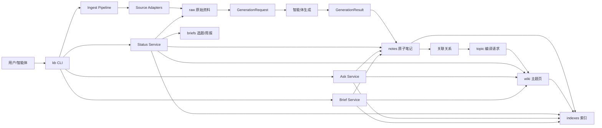
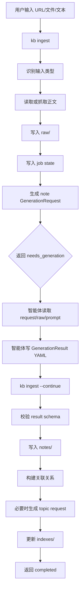
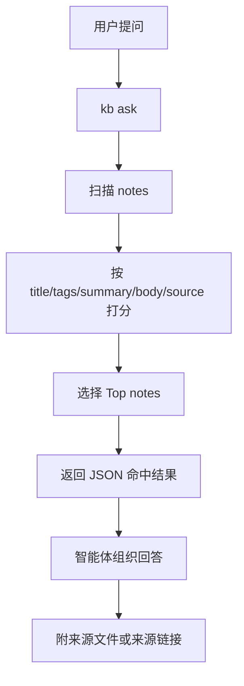
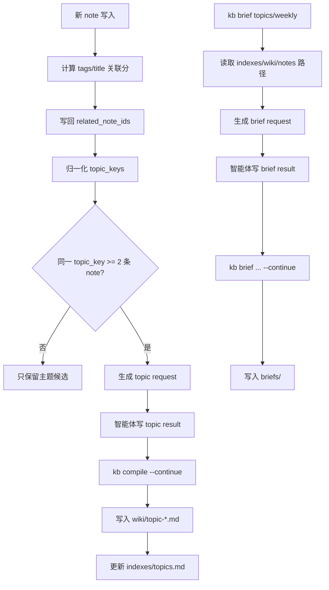

# 项目说明与使用指南

## 1. 一句话说明

这是一个面向个人写作和知识管理的本地 AI 知识库项目。

它不是通用知识管理平台，也不是单纯的文档目录，而是一个“知识库工作区 + 本地 CLI 执行内核 + 智能体协作协议”的组合：

```text
用户表达
  -> Claude Code / Codex 等智能体
  -> 调用 kb CLI
  -> 读写 knowledge/ 下的知识库文件
```

项目的目标是让你把链接、PDF、Markdown、纯文本、想法丢进来，系统保存原文、生成结构化笔记、建立关联、编译主题页，并支持问答、选题和周报。

## 2. 当前项目定位

当前仓库分为两层：

```text
fuxix/
  外层：开发这个知识库系统
  knowledge/
    内层：实际个人知识库工作区
```

外层用于开发和维护知识库系统：

- 管理 Python 项目配置
- 维护测试
- 编写产品和工程文档
- 开发 `knowledge/kb/` 功能代码

内层 `knowledge/` 是你的实际知识库：

- 存放知识内容
- 存放运行状态
- 存放生成请求和生成结果
- 存放智能体使用协议
- 包含可被 Claude Code / Codex 直接调用的 `kb` 功能代码

## 3. 目录结构

```text
fuxix/
  AGENTS.md
  README.md
  pyproject.toml
  uv.lock
  tests/
  docs/
    product/
    engineering/
    superpowers/

  knowledge/
    AGENTS.md
    kb.yaml
    kb/
    docs/
    prompts/
    raw/
    notes/
    wiki/
    briefs/
    indexes/
    state/
    logs/
```

### 3.1 外层目录

| 路径 | 作用 |
| --- | --- |
| `AGENTS.md` | 外层项目开发规则 |
| `README.md` | 项目最小总览 |
| `pyproject.toml` | Python 项目配置、依赖、CLI 入口 |
| `uv.lock` | 依赖锁定 |
| `tests/` | 功能代码测试 |
| `docs/product/` | 产品文档 |
| `docs/engineering/` | 工程架构、技术说明、使用指南 |
| `docs/superpowers/` | 实施计划、历史方案、过程记录 |

### 3.2 内层 `knowledge/`

| 路径 | 作用 |
| --- | --- |
| `knowledge/AGENTS.md` | 知识库使用规则 |
| `knowledge/kb.yaml` | 知识库配置 |
| `knowledge/kb/` | 知识库功能代码 |
| `knowledge/docs/` | 智能体使用协议和知识库操作说明 |
| `knowledge/prompts/` | note/topic/brief 生成 prompt |
| `knowledge/raw/` | 原始资料归档 |
| `knowledge/notes/` | 原子笔记 |
| `knowledge/wiki/` | 主题页 |
| `knowledge/briefs/` | 选题和周报 |
| `knowledge/indexes/` | 索引导航文件 |
| `knowledge/state/` | job、generation request/result |
| `knowledge/logs/` | 运行日志 |

## 4. 核心架构

系统主链路是：

```text
source -> raw -> note -> relation -> topic -> index -> ask/brief
```

对应架构图：



## 5. 为什么采用“两段式生成”

当前项目不直接接入 OpenAI、Claude 或本地模型 API。

原因是首版要先把知识库的文件结构、状态管理、schema 校验、索引和命令协议跑稳。语义内容由智能体完成，`kb` 只负责确定性的事情：

- 抓取或读取输入
- 保存原文
- 生成 `GenerationRequest`
- 校验 `GenerationResult`
- 写入 note/topic/brief
- 更新索引
- 返回 JSON 状态

两段式流程如下：

```mermaid
sequenceDiagram
    participant User as 用户
    participant Agent as Claude Code / Codex
    participant KB as kb CLI
    participant FS as knowledge 文件系统

    User->>Agent: 把链接/文本/文件入库
    Agent->>KB: uv run kb ingest <input>
    KB->>FS: 写入 raw 和 job state
    KB->>FS: 生成 GenerationRequest
    KB-->>Agent: 返回 needs_generation
    Agent->>FS: 读取 request、raw、prompt
    Agent->>FS: 写入 GenerationResult
    Agent->>KB: uv run kb ingest --continue <job_id>
    KB->>FS: 校验 result
    KB->>FS: 写入 notes、更新 indexes
    KB-->>Agent: 返回 completed
    Agent-->>User: 汇报结果和来源
```



## 6. 核心命令

所有知识库使用命令都建议在 `knowledge/` 目录下执行。

```powershell
cd knowledge
```

### 6.1 初始化

```powershell
uv run kb init
```

作用：

- 创建运行目录
- 创建默认 prompt
- 不会清空已有内容

### 6.2 入库

```powershell
uv run kb ingest "<input>"
```

`<input>` 可以是：

- URL
- 本地文件路径
- PDF
- Markdown
- txt
- 一段纯文本

首次执行通常返回：

```json
{
  "status": "needs_generation",
  "next_action": "write_generation_result",
  "generation_request_path": "...",
  "generation_result_path": "..."
}
```

这表示 `kb` 已经保存原文并生成请求，接下来需要智能体读取请求并写入结构化结果。

智能体写好结果后继续：

```powershell
uv run kb ingest --continue <job_id>
```

完成后会写入：

- `notes/YYYYMMDD/<note_id>.md`
- `indexes/recent.md`
- `indexes/tags.md`
- `indexes/sources.md`

如果命中可编译主题，还会生成 topic 编译请求。

### 6.3 盘点

```powershell
uv run kb status
```

用于回答：

- 当前知识库中有哪些内容
- 当前有多少笔记
- 有哪些标签
- 有哪些来源
- 最近入库了什么

返回结果是结构化 JSON，包含 `counts / recent_notes / tags / sources`。智能体应基于该结果回答，不全局搜索 `knowledge/`。

### 6.4 查询

```powershell
uv run kb ask "你要问的问题"
```

当前查询策略是扫描 `notes/**/*.md`，按关键词打分：

- 标题命中
- 标签命中
- 摘要命中
- 正文命中
- 来源命中

返回结果是结构化 JSON，智能体再基于命中的 notes 组织自然语言回答。

### 6.5 主题页编译

当 `ingest --continue` 发现同一主题下有至少 2 条相关 note，会生成 `topic` 编译请求。

智能体写入 topic 结果后执行：

```powershell
uv run kb compile --continue <job_id> --topic-key <topic_key>
```

完成后会写入：

- `wiki/topic-<topic_key>.md`
- `indexes/topics.md`

### 6.6 生成选题

```powershell
uv run kb brief topics
```

该命令会生成 `brief_topics` 请求。智能体写入结果后继续：

```powershell
uv run kb brief topics --continue <job_id>
```

完成后写入：

```text
briefs/topic-picks-YYYYMMDD.md
```

### 6.7 生成周报

```powershell
uv run kb brief weekly
```

该命令会生成 `brief_weekly` 请求。智能体写入结果后继续：

```powershell
uv run kb brief weekly --continue <job_id>
```

完成后写入：

```text
briefs/weekly-YYYY-WW.md
```

## 7. 入库流程



## 8. 查询流程



## 9. 主题和 brief 流程



## 10. 开发这个项目

开发功能代码时，在仓库外层执行：

```powershell
uv run pytest -q
uv run ruff check .
```

功能代码在：

```text
knowledge/kb/
```

测试在：

```text
tests/
```

Python 包名仍然是：

```text
kb
```

`pyproject.toml` 通过以下配置让包从 `knowledge/kb` 构建：

```toml
[tool.hatch.build.targets.wheel]
packages = ["knowledge/kb"]

[tool.pytest.ini_options]
testpaths = ["tests"]
pythonpath = ["knowledge"]
```

## 11. 智能体如何使用

Claude Code / Codex 的使用协议放在：

```text
knowledge/docs/智能体使用协议.md
```

核心规则：

- 日常使用知识库时进入 `knowledge/`
- 入库、盘点、查询、选题、周报都调用 `uv run kb ...`
- 盘点类问题使用 `uv run kb status`，不要全局搜索 `knowledge/`
- 不直接修改 `raw/`、`notes/`、`wiki/`、`briefs/`、`indexes/`、`state/`
- 遇到 `needs_generation` 时，智能体读取 request，写 result，再执行 `--continue`
- 回复用户时说明实际执行的命令，并附来源

## 12. 当前能力边界

已经具备：

- 本地 CLI
- URL、文本、Markdown、txt、PDF 输入适配
- 原文归档
- GenerationRequest / GenerationResult 两段式生成
- note schema 校验
- 原子笔记落盘
- Markdown 索引
- kb status 知识库盘点
- 关键词 ask
- 轻量关联关系
- topic request 与 topic 落盘
- brief topics / weekly 两段式生成

暂未实现或暂不做：

- 直接接入 LLM API
- 向量库/RAG
- Web UI
- 多人协作
- 多端同步
- 权限系统
- 自动发布

## 13. 推荐使用方式

### 13.1 普通知识库使用

进入 `knowledge/`：

```powershell
cd knowledge
```

然后告诉智能体：

```text
把这个链接入库：...
当前知识库有哪些内容
查一下知识库里关于 AI 写作的内容
基于知识库生成 3 个选题
生成本周知识周报
```

智能体应按 `knowledge/AGENTS.md` 和 `knowledge/docs/智能体使用协议.md` 调用 `kb`。

### 13.2 项目开发

在仓库外层：

```powershell
uv run pytest -q
uv run ruff check .
```

只有在你明确要求“改功能、修 bug、调整 CLI、补测试”时，才修改 `knowledge/kb/`。

## 14. 阅读顺序

如果你想重新理解这个项目，建议按这个顺序读：

1. `README.md`
2. `AGENTS.md`
3. `knowledge/AGENTS.md`
4. `knowledge/docs/智能体使用协议.md`
5. `docs/engineering/项目说明与使用指南.md`
6. `docs/product/AI知识库MVP产品设计.md`
7. `docs/engineering/AI知识库技术架构文档.md`

## 15. 总结

这个项目的核心价值不是“保存文件”，而是把个人知识管理拆成一条可追踪、可验证、可被智能体协作执行的知识编译链。

它现在的形态是：

```text
外层负责开发知识库系统
内层 knowledge/ 负责承载和使用个人知识库
kb CLI 负责确定性文件操作
智能体负责语义生成和自然语言交互
```

只要保持这个边界，项目就不会再退回到“代码、数据、文档、智能体规则混在一起”的状态。
